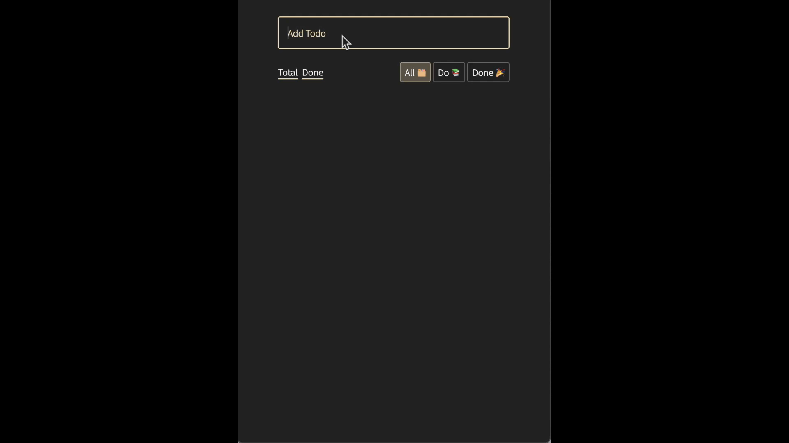

# CRUD Todo List / 7일

## 중점적인 고민 사항 🧐

> component 디자인 개선과 **reactiveness** 추가

1. 정적인 `html` 템플릿과 **reactiveness**와 rerendering 로직을 추가해봅시다!
2. 절차적 프로그래밍 함수형 프로그래밍으로 개선해봅시다!
3. `js`를 `ts`로 변경하여 구조적 안정성을 추가해봅시다! (개인 진행)

## Reactiveness 해결 방법 🔥

> 반응형 상태 시스템 구축

### 1. `signal`: 상태를 담고 있는 전기 신호

> 라디오 `캐스터👨‍🚀`가 **`방송🎙️`**(**`전기 신호`**)을 한다고 생각을 해봅시다.

**선언형** 상태, signal

```ts
const [count, setCount, resetCount, prevCount] = signal<number>(0)
```

**`signal` 사용하기** / 조회와 업데이트

1. `count` - signal의 **현재 상태를 반환하는** `getter`입니다.
2. `setCount` - signal의 **상태를 업데이트하는** `setter`입니다.
3. `resetCount` - **signal의 초기값으로 초기화 하는** `setter`입니다.
4. `prevCount` - **signal의 바로 직전 상태를 반환하는** `getter`입니다.

```ts
count()
//🟢 0

setCount(1)
//🟢 1

setCount((c) => c + 99)
//🟢 100

resetCount()
//🟢 0

prevCount()
//🟢 100
```

### 2. `track`: 사용하는 `signal`을 관찰하고 변화되면 저장된 함수를 실행

> 캐스터의 **`방송🎙️`**(**`전기 신호`**)을 송출하는 **`방송국🛰️`** 으로 생각해봅시다.
>
> 방송국은 캐스터가 **`방송🎙️`**(**`전기 신호`**)을 시작하기 전까지 **`대기`**(**`관찰`**) 하다가, 방송이 시작되면 **`송출`**(**`저장된 함수를 실행`**) 하는 것과 같습니다.

```ts
const [count, setCount, resetCount, prevCount] = signal<number>(0)

setCount((c) => c + 1)
setCount((c) => c + 1)
setCount((c) => c + 1)

track(() => {
    // ✅ count를 관찰합니다
    console.log(count() % 2 === 0 ? "짝수" : "홀수")

    //🟢 console => "짝수"
    //🟢 console => "홀수"
    //🟢 console => "짝수"
    //🟢 console => "홀수"
})
```

### 3. reactive `component`: 사용되는 `signal`을 관찰하고 변화되면 **rerendering**

```ts
const Counter = () => {
    const [count, setCount] = signal(0)

    const plus = () = setCount(c => c + 1)
    const minus = () = setCount(c => c - 1)

    return $component(
        () => html`
            <button id="plus">🔺</button>
            <div>${count()}</div>
            <button id="minus">🔻</button>
        `
    )
        .addEvent(() => ({
            targetId: "plus",
            type: "click",
            handler: plus,
        }))
        .addEvent(() => ({
            targetId: "minus",
            type: "click",
            handler: minus,
        }))
}

Counter().render()
```

### 4. static `component`: 상태 변경이 없는 컴포넌트를 `DOM` tree에 mount할 때 사용

> 레이아웃과 같은 정적인 틀을 컴포넌트화 할때 사용합니다.

reactive component로 선언하는 경우, **rerendering** 시 `DOM` tree에 mount되기 전에 특정 `id`에 접근하려고 할때 불가능한 문제가 발생합니다.

✅ 특정 `id`에 reactive component mount시키기

```ts
const App = () =>
    component(
        () => html`
            <div class="${style.container}">
                <div id="todo-list-head" class="${style.headContainer}"></div>
                <div id="todo-list-render" class="${style.listContainer}"></div>
            </div>
        `
    )

App().render()
// App은 "#app"에 mount 되었습니다.

//✅ 성공적으로 #todo-list-head에 mount됩니다.
SomeReactiveComponent.render("todo-list-head")
```

🚫 특정 `id`에 rerendering시 접근 불가

```ts
const App = () =>
    $component(
        () => html`
            <div class="${style.container}">
                <div id="todo-list-head" class="${style.headContainer}"></div>
                <div id="todo-list-render" class="${style.listContainer}"></div>
            </div>
        `
    )

App().render()

// 🚫 App이 rerender 될 때, mount되지 않았기에 SomeReactiveComponent는 "todo-list-head"에 mount되지 않습니다.
SomeReactiveComponent.render("todo-list-head")
```

### 5. static `template`: `html` template로 반복되는 렌더링 로직 추출

```ts
const Button = ({ text, emoji }: ButtonProps) => {
    return html`
        <button type="button" class="${style.btn}">
            <span>${text}</span>
            ${emoji ? `<span>${emoji}</span>` : ""}
        </button>
    `
}

Button({ text: "이건 버튼", emoji: "✅" })
// Button은 그저 템플릿일뿐, component(() => html`...`)에서 사용 전에는 mount되지 않습니다.
```

[tagged-template-literal](https://developer.mozilla.org/en-US/docs/Web/JavaScript/Reference/Template_literals)문법을 이용해 `html`을 만들어 `lit-html`확장을 사용하여 개발 편의성(DX)을 높여보았습니다!

-   `lit-html` - html``로 내부의 요소를 하이라이팅 해줌
    
-   해당기능을 함께 사용하지 않을 때 🤬
    
-   해당기능을 함께 사용할 때 🤗
    

## 구현사항 ✅

1.  투두 추가(Create)
2.  투두 변경사항 UI 즉시 반영(Read)
3.  투두 삭제(Delete)
4.  투두 수정(Update)
5.  `web storage api`를 활용한 브라우저 데이터 유지
6.  `media query`를 사용한 mobile 중심 반응형 디자인
    **mobile UI** → **desktop UI** 로 제작

## 구현결과 🎉



## 좋았던 점 ✅

1. `solidJs`의 reactive 방법론을 적용하여 성공적으로 statefull한 컴포넌트를 제작할 수 있었습니다.

2. 자동적으로 의존성(dependncy)을 추적하며 렌더링 하기에 `react`에서 자주 등장하는 human error가 적어졌습니다.

부수효과를 다룰 때 사용하는 `react`의 `useEffect`

```tsx
const Counter = () => {
    const [count, setCount] = React.useState(0)

    React.useEffect(() => {
        // count값의 변경을 감지하기 위해 명시적으로 dependency를 작성해줘야 함
    }, [count])

    //...
}
```

`track` 함수로 자동으로 의존성 추적

```ts
const Counter = () => {
    const [count, setCount] = signal(0)

    track(() => {
        count()
        // count를 tract callback에서 호출하면 자동으로 의존성이 추적됨
    })

    //...
}
```

## 개선해보면 좋은점 🔸

1. `signal` 호출에 **memoization** 함수가 따로 없기에, 같은 내용을 연산할 때 불필요한 렌더링이 발생합니다.

2. `event`를 다량으로 부착시 가독성이 좋지 않습니다.
   `jsx`를 사용하지 않기에 발생하는 문제입니다... `inline event` 부착 등도 고려 했으나, 모든 `evnet handler`를 전역적으로 선언해야 하기에 코드 품질면에서 좋지 않습니다.🥲

3. component 생성시에 parent `div`(일명 fragment)가 존재하고 원하는 위치(특정 `id`)에 렌더링하기가 까다롭습니다.
